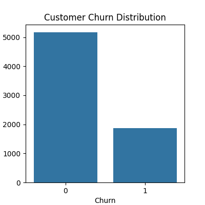
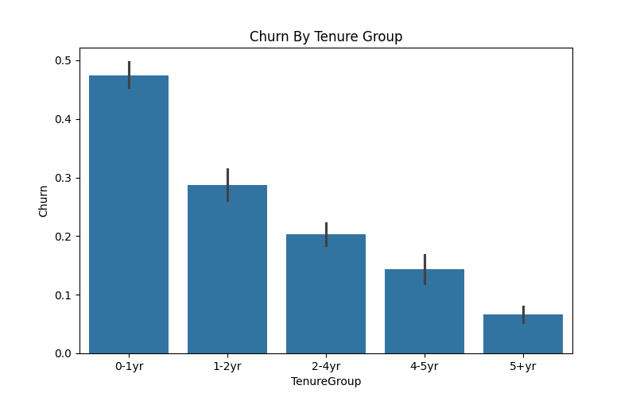
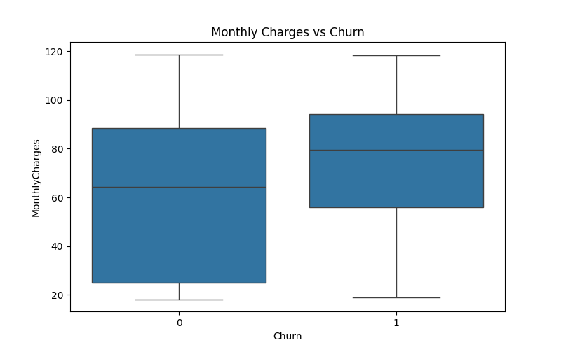
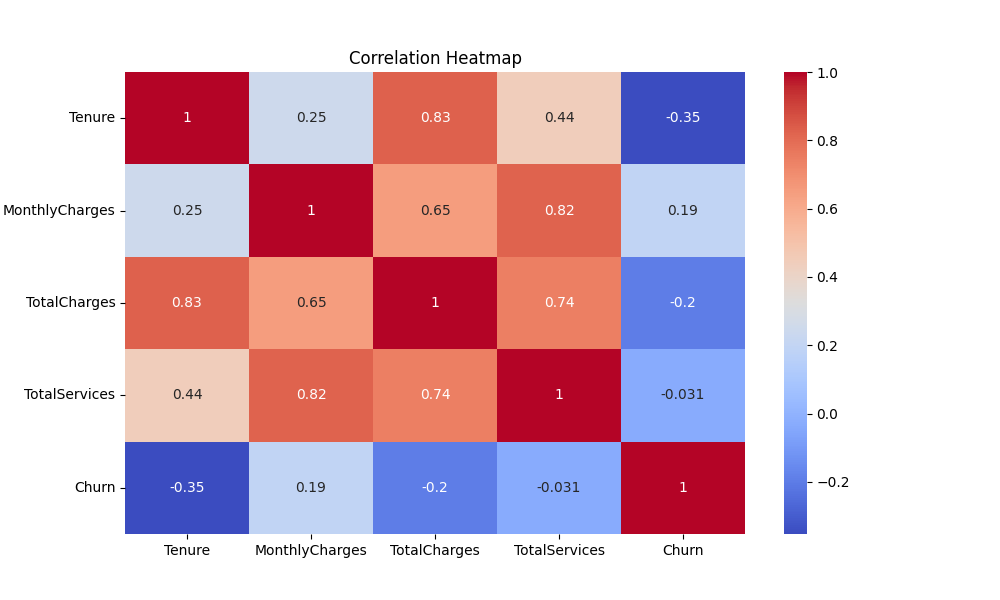

# 📊 Telco Customer Churn Analysis

## 📌 Objective
The objective of this project is to analyze **customer behavior** and identify the **key factors driving customer churn** in a telecom company. The goal is to derive **actionable insights** that can help improve **customer retention** and reduce churn.

---

## 📂 Dataset
- **Source:** Kaggle Telco Customer Churn Dataset  
- **Records:** 7,043 customers  
- **Features:** Customer demographics, account information, subscribed services, and billing details  

---

## 🧹 Data Cleaning
- Converted data types for **accurate analysis and consistency**  
- Handled missing values in `TotalCharges` using **business logic (tenure-based imputation)**  
- Encoded categorical variables into **numerical format for analysis**  
- Standardized service-related categories to ensure **data uniformity**  

---

## ⚙️ Feature Engineering
- Created `TenureGroup` to analyze **customer lifecycle stages**  
- Created `TotalServices` to measure **customer engagement level**  
- Engineered `AvgCharges` to evaluate **average spending behavior**  
- Removed redundant features after evaluation to **avoid multicollinearity and duplication**  

---

## 📊 Exploratory Data Analysis

### 🔹 Key Areas Analyzed
- Customer **churn distribution**  
- **Contract types** and their impact on churn  
- Customer **tenure and lifecycle behavior**  
- **Service usage and engagement levels**  
- **Pricing and revenue-related factors**  

---

## 🔥 Key Insights

- Customers on **month-to-month contracts** have the **highest churn rates**, indicating low long-term commitment  
- **New customers (low tenure)** are at the **highest risk of churn**, highlighting early lifecycle vulnerability  
- Customers with **fewer subscribed services** show **significantly higher churn**, indicating lower engagement  
- **Higher monthly charges** are associated with **increased churn**, suggesting pricing sensitivity  
- **Customer engagement and tenure** are the **strongest indicators of retention**  

---

## 📈 Visualizations

Key visualizations include:

- Churn Distribution  
- Churn by Tenure  
- Monthly Charges vs Churn  
- Correlation Heatmap  

*(Refer to the `/visuals` folder for saved charts)*

---

## 🧠 Business Recommendations

- **Encourage long-term contracts** through incentives and discounts  
- **Improve onboarding experience** to reduce early-stage churn  
- **Promote bundled services** to increase customer engagement and retention  
- **Review pricing strategies** for high-cost customer segments  
- Implement **targeted retention campaigns** for high-risk customers  

---

## 🛠️ Tools & Technologies

- **Python**  
- **Pandas**  
- **NumPy**  
- **Matplotlib**  
- **Seaborn**  
- **Jupyter Notebook**  

---

## 📁 Project Structure
telco-churn-analysis/ 
│ 
├── data/ 
├── notebooks/ 
├── visuals/ 
├── README.md 
├── requirements.txt 
└── .gitignore 

---

## 🚀 Conclusion

This analysis reveals that customer churn is primarily driven by a combination of **low engagement**, **lack of long-term commitment**, **early-stage lifecycle risk**, and **pricing sensitivity**.  

By focusing on **customer retention strategies, service engagement, and pricing optimization**, businesses can significantly improve **customer lifetime value** and reduce churn.

---

## 📬 Contact

If you have any questions or feedback, feel free to connect!
